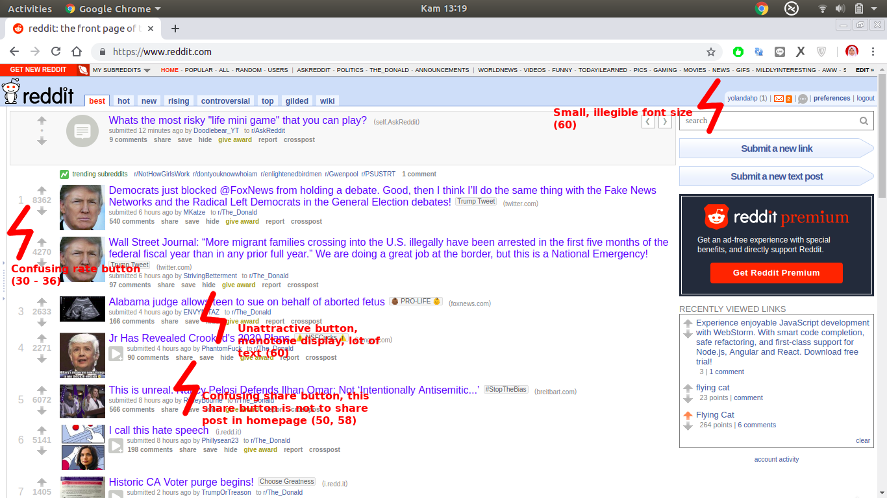
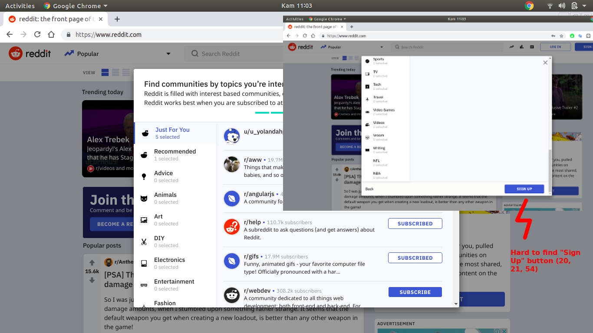
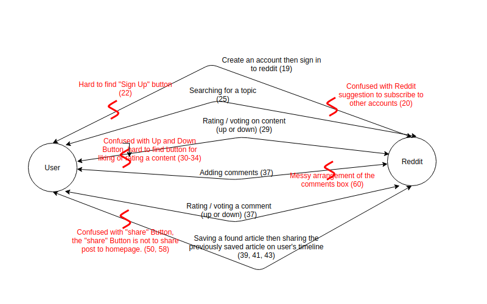
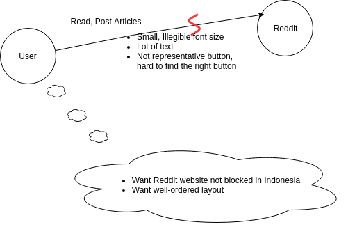

# Contextual Inquiry and Analysis
## Device/ App/ Website Description
Reddit (reddit.com) is a social news aggregation site that allows registered users to submit post and comments in a variety of categories. Registered users are also able to send messages and share articles with other users. Registered users also can customize which categories / SubReddit's they are subscribed to.

## Instruction Script
Six separate tasks were observed in total including: 

1. Create an account then sign in to reddit.
2. Searching for a topic.
3. Rating / voting on content (up or down)
4. Adding comments
5. Rating / voting a comment (up or down)
6. Saving a found article then sharing the previously saved article on user's timeline.

## User Description
- Female
- 21 years old
- Student of SeaTrans Department ITS
- Almost always connected to Internet
- Typically share multimedia content a few times for a week
- Had no experience with Reddit

## Transcript
```text
1. Saya     : Seberapa sering kamu menggunakan internet?
2. User     : Hampir selalu menggunakan internet, sih.
3. Saya     : Seberapa sering kamu meng-share (membagikan) suatu multimedia konten / postingan, baik postingan dari kamu sendiri, maupun postingan orang lain?
4. User     : Lumayan sering, setidaknya sehari pernah.
5. Saya     : Dalam skala satu sampai lima nih, berapa kemungkinan kamu akan membagikan suatu foto atau video atau media lainnya di sosial media?
6. User     : Tiga.
7. Saya     : Dalam skala satu sampai lima, berapa kemungkinan kamu akan mengomentari suatu postingan di internet?
8. User     : Dua.
9. Saya     : Dalam skala satu sampai lima, berapa kemungkinan kamu akan menyukai atau tidak suka, tekan tombol like atau nge unlike suatu postingan?
10. User    : Empat.
11. Saya    : Oke. Sebelumnya pernah make Reddit ngga? Atau pernah denger Reddit gitu?
12. User    : Ngga, ngga pernah. Apa itu?
13. Saya    : Jadi, Reddit itu kaya sosial media gitu. Ya kamu juga bisa berkirim pesan dengan orang lain, kamu juga bisa meng-posting sesuatu, terus bisa lihat postingan orang lain, bisa like sama mengomentari postingan orang lain juga.
14. User    : Kaya Line ya? eh kaya twitter?
15. Saya    : Iya. mirip timeline nya twitter gitu. Tapi fitur-fiturnya ada yang beda. Kamu juga bisa nge post pertanyaan-pertanyaan gitu.
16. User    : Oooh, gitu.
17. Saya    : Iya. Oke sekarang kita coba Reddit ya. Coba kamu ngelakuin apa yang aku bilang, terus jangan tanya-tanya dulu. Nanti kalau emang mentok aku kasih hint.
18. User    : Oke..
19. Saya    : Sekarang coba kamu bikin akun baru pakai emailmu.
(User mencoba mendaftar akun baru.)
(User merasa kebingungan ketika harus ada langkah yang harus memilih 5 akun yang harus disubscribe, sementara tombol "sign up" nya terletak dibawah pilihan akun-akun yang disarankan oleh Reddit.)
20. User    : Ini maksudnya apa sih?
21. Saya    : Jadi ini kamu bisa milih beberapa akun yang mungkin kamu suka, jadi untuk kedepannya Reddit bisa menyesuaikan atau merekomendasikan postingan yang mungkin sesuai dengan apa yang kamu sukai.
22. User    : Ohh.
(User memilih beberapa akun, masih kebingungan, kemudian akhirnya menemukan tombol "sign up". Setelah menghabiskan waktu hampir 5 menit untuk mendaftar)
23. Saya    : Nah. Udah ya, sekarang coba kamu login.
(User login)
25. Saya    : Oke. Nah sekarang coba kamu cari postingan tentang "kucing terbang", "flying cat" gitu
(User mencari tombol search kemudian menuliskan "flying cat" kemudian menekan tombol enter) 
26. User    : Udah. Ini pilih yang mana?
27. Saya    : Oke. Pilih salah satu aja..
(User memilih salah satu postingan kucing. Kemudian tertawa melihat postingannya.)
29. Saya    : Nah sekarang kan kamu udah nemu salah satu postingan. Sekarang kamu coba kasih like atau vote atau rating untuk menyukai postingan itu.
(User kebingungan mencari tombol yang dimaksud untuk menyukai postingan. Setelah menghabiskan waktu sekitar tiga menit)
30. User    : Gimana ini? Masa give award? Bukan. Gimana ini..
31. Saya    : Jadi kamu bisa nge upvote atau nge down vote postingan itu.
32. User    : Ha? bintang-bintangnya gaada. Gaada tulisannya buat ngelike atau nge-rate. Gabisa, tut. yaapa ini?
33. Saya    : Bisa up or down.
34. User    : Gaada tulisannya. Gimana ini??.. Ooh.. Ini ta?
(User menemukan tombol up-vote)
35. Saya    : Iya. Berarti kamu menyukai postingan itu ya?
36. User    : Iya, tapi ini abis ku teken balik lagi. Lhoo. Balik lagi.
37. Saya    : Oh iya. Mungkin koneksi internetnya. Oke, sekarang coba kamu nambahin comment. Comment "cute" gitu. Terus coba juga kamu like comment orang lain
38. User    : Oh easy. Udah
(User menambahkan komentar kemudian nge up-vote pada salah satu artikel)
39. Saya    : Oke. Sekarang coba kamu simpen postingan itu di profilmu, kaya di-archive gitu.  
40. User    : Oh ini ya
(user menekan tombol save).
41. Saya    : Coba kamu cari artikel lain terus disave juga.
42. User    : Oke.
43. Saya    : Terus abis nge save kamu cari semua artikel yang sudah kamu save.
(User awalnya menuju ke profile kemudian menemukan halaman overview. Pada awalnya mengira itu adalah yang dia temukan. Tetapi saya bilang kalau saya sebelumnya sudah menyimpan beberapa post juga sebelum dia menggunakan akun ini. Kemudian baru user menemukan halaman saved post)
48. User    : Ohh ini ya.
49. Saya    : Oke sekarang coba kamu share salah satu post yang sudah kamu save di timeline kamu.
(User pada awalnya menekan tombol "share" kemudian kebingungan karena "share" yang dimaksud tidak sesuai. Tombol bagikan yang dia tekan merupakan bagikan ke aplikasi lain atau kirim sebagai pesan pribadi ke user lain)
50. User    : Eh kok gini, aku mau ngeshare di timeline aku. Ini bagikan ke facebook, bukan. Kalau ini kirim sebagai pesan? bukan.
(kemudian user menemukan tombol crosspost)
52. User    : Eh kalau crosspost ini apa? Ohh ini ya? Choose where to crosspost. Your profile. Iya ini ya benar! Ooh kukira share (tombol "share") ini, ternyata yang ini. Oooh.
53. Saya    : Iya hehe. Okee. Sekarang post survey. Dari sekian task yang aku berikan, mana yang menurutmu paling sulit di Reddit ini?
54. User    : Hmmm, Sign Up nya, pertama kali.
55. Saya    : Ohh sign up nya ya. Hmm, apa kamu akan menggunakan Reddit lagi?
56. User    : Hmm ngga kayanya.
57. Saya    : Kenapa? Apa yang menurutmu kurang dari Reddit ini? Apa yang menurutmu bisa diperbaiki dari Reddit?
58. User    : Ini kurang emot-emot. Kurang tombol yang mempresentasikan fungsinya. Kaya ini share tadi. Terus kaya jempol buat menyukai postingan. Kan kalau kaya gini (tombol up, tombol down) kan orang jadi ngga tahu maksudnya apa ini, scroll ta atau apa ta.
59. Saya    : Ooh gitu ya. Jadi harusnya buttonnya lebih attractive gitu yah. Terus ada lagi?
60. User    : Iya. Terus ini ni, tampilannya itu terlalu monotone. Banyak text-textnya. Ini kolom komentarnya juga biasa aja, harusnya dikotak-kotakin. Biar lebih rapi, lebih menarik. Ini tu tampilannya terlalu banyak tulisannya. Terus kecil-kecil. Kan jadi bingung. 
61. Saya    : Hmmm gitu yah. Oke. Udah nih, ada lagi?
62. User    : Iya, udah.
63. Saya    : Okeee, terima kasih ya *****

```

## Models and Annotations
### Artifact Model





### Flow Model


### Cultural Model


## Do's and Don't's
### Do's
- The creation of an account must require a valid email address
- Move the search bar in the top
- Make "rate" button more noticeable

### Dont's
- Muted tones and cluttered, monotone text
- Small, illegible font size


# Remarks
> * Thanks for finishing this assignment completely. Overall, all the sections are well written.
> * Despite being designed as light-weight social media, your finding about the bad design on upvote/downvote features is a good one. I am looking forward for your design to solve this particular problem.

| Working Days | Commits before D | Commits after D | Presentation (80%) | Repo (20%) | Total |
|:------------:|:----------------:|:---------------:|:------------------:|:----------:|:-----:|
| 2            | 4                | 0               | 88                 | 82.5       | 86.9  |
